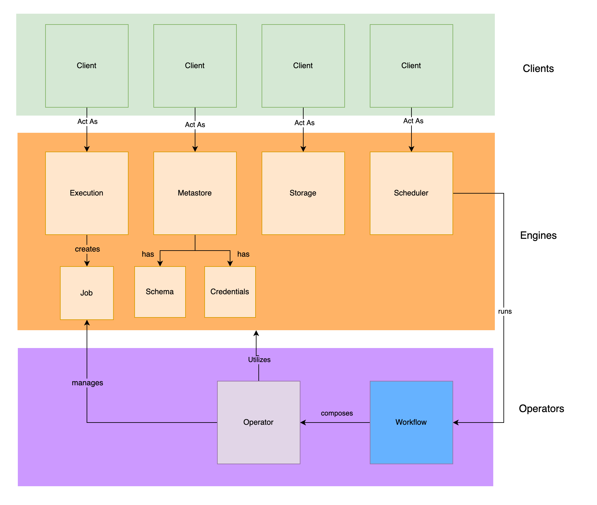
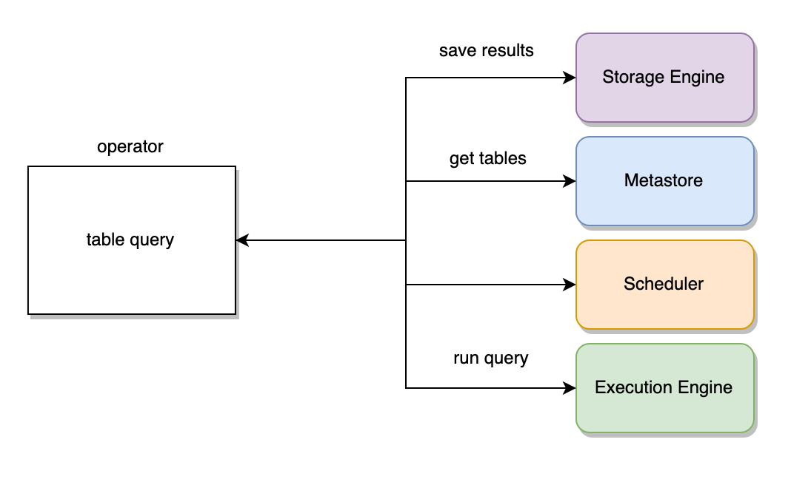

 

# Mason Data Operator Framework 

What is Mason?  In short, Mason is the connecting tissue for your data projects.  
1.  It creates a data-aware alternative to Airflow operators that depends less heavily on Python scripting.
2.  It's like react components, but for data pipelines.
3.  It's an open source answer to Glue.
4.  It gives you self-contained, composable, parameterized, and functional data operators.

Mason is a curated library of data pipeline components with abstracted backend implementations for various big data clients.

Mason interfaces with clients using abstractions called Engines. These Engines broker the relationship between Operators and Workflows, which define a particular job, and the various Clients that get the job done. Out of the box, Mason defines four Engines - Storage, Execution, Metastore, and Scheduler.

Once configured, Mason gives you a declarative ability to perform simple statements like these:

```
mason run operator table get -p "database_name:<<DATABASE_NAME>>,table_name:<<TABLE_NAME>>"
```

```
mason run operator job get -p "job_id:<<JOB_ID>>"
```

```
mason run operator table infer -p "storage_path:<<STORAGE_PATH>>,database_name:<<DATABASE_NAME>>,table_name:<<TABLE_NAME>>"
```

and for the operators to perform sensible actions regardless of the clients used for each engine, be they local file systems, S3, Athena, Spark, Dask, Presto, Glue, etc.

The four engines Mason ships with by default are Metastore, Execution, Scheduler, and Storage.


1.   Metastore - Defines concepts like databases and tables, and allows interacting with dataset metadata such as partitioning or schema information.  Some example metastore clients would be Glue or Hive.
2.   Execution - Defines a means to "compute" or derive additional datasets on source data in metastore tables.   This includes programmatic serial or SQL analytical computation on data.  Example execution engines would be Spark, Presto, and Athena.
3.   Scheduler -  Anything that involves scheduling frequency of data jobs and job DAGs.  Example scheduler clients would be Airflow, DigDag and Azkaban.
4.   Storage - Any activity that involves serial (row level) access and storage of data.  Some example storage clients would be S3 and HDFS.

Mason is heavily inspired by language-agnostic configuration-driven tools like kubernetes, helm, and terraform.   Mason aims to help to make existing higher-level open-source big-data tools easier to coordinate and interact with for individuals of varying expertise.  Mason does not attempt to make provisioning and standing up such services referenced in its configurations easier and thus is meant to be used in conjunction with tools like kubernetes and helm.

Mason's mission is to provide ways to build composable self-contained functional units called "Data Operators" which companies can stitch together to easily provide end-to-end data pipelines.   The target demographic of Mason are companies that are just breaking into the enterprise data space, or companies that are looking to consolidate their data operations.

## Quickstart

### Docker

If you are implementing AWS clients, remember to update `~/.mason/.env` to include AWS credentials. 
```.env
AWS_ACCESS_KEY_ID=<KEY_ID>
AWS_SECRET_ACCESS_KEY=<SECRET_KEY>
```

Note mason also looks at the working directory's `.env`
These credentials should have the needed permissions for the AWS services you are specifying as engine clients.  You can see all such configurations for various cloud providers in `.env.example`.

If you are using a kubernetes-based execution engine or scheduler, make sure that your kubernetes config is located at `~/.kube/config`.

To build the Docker image, run:
```
./docker_build
```
Then run `docker-compose` to start a mason server locally:
```
docker-compose up
```

Swagger UI for registered operators can then be found at `http://localhost:5000/api/ui/`. 

You can access additional mason commands by shelling into the running Docker container and running them via `docker_attach`:

```
./docker_attach
root@<SHA>:/app# mason
Usage: mason [OPTIONS] COMMAND [ARGS]...

  ___  ___
  |  \/  |
  | .  . | __ _ ___  ___  _ __
  | |\/| |/ _` / __|/ _ \| '_ \     
  | |  | | (_| \__ \ (_) | | | |
  \_|  |_/\__,_|___/\___/|_| |_|

  Mason Data Operator Framework

Options:
  --version  Show the version and exit.
  --help     Show this message and exit.

Commands:
  apply     Apply mason yaml file(s)
  config    Interact with mason configs
  get       Get mason resource (operator, workflow, config)
  run       Runs mason workflow or operator
  server    Runs mason flask server on port 5000
  validate  Validates and performs a dry run of a mason workflow or operator
```

Note that the Dockerfile registers a set of example operators by default.  Comment out these lines and register different operators if you wish to do so during Docker build.

### Python Package

To install the python `mason` package instead, first run:
```
./scripts/install.sh
```
Mason leverages `mypy` heavily to ensure that function signatures and types are in line. To run the tests for mason (which includes running mypy by default), run:

```
./scripts/test.sh
```

## Basic Mason Commands

### Apply

Apply applies mason yaml files for resources in mason (operators, workflows and configs):

```shell
> mason apply mason/examples/
+---------------------------------------------+
| Creating MASON_HOME at ~/.mason/            |
+---------------------------------------------+
+----------------------------------------------------------+
| Creating OPERATOR_HOME at ~/.mason/operators/            |
+----------------------------------------------------------+
+----------------------------------------------------------+
| Creating WORKFLOW_HOME at ~/.mason/workflows/            |
+----------------------------------------------------------+
+------------------------------------------------------+
| Creating CONFIG_HOME at ~/.mason/configs/            |
+------------------------------------------------------+
2021-02-23 20:20:22.989394: Successfully saved Operator schedule:delete
2021-02-23 20:20:22.990765: Successfully saved Operator table:delete
2021-02-23 20:20:22.991810: Successfully saved Operator table:merge
2021-02-23 20:20:22.992958: Successfully saved Operator table:refresh
2021-02-23 20:20:22.994201: Successfully saved Operator table:get
2021-02-23 20:20:22.995193: Successfully saved Operator table:list
2021-02-23 20:20:22.995998: Successfully saved Operator table:format
2021-02-23 20:20:22.996749: Successfully saved Operator table:infer
2021-02-23 20:20:22.997471: Successfully saved Operator table:fake
2021-02-23 20:20:22.998230: Successfully saved Operator table:query
2021-02-23 20:20:22.999078: Successfully saved Operator job:get
2021-02-23 20:20:22.999957: Successfully saved Workflow table:validated_infer
2021-02-23 20:20:23.000717: Successfully saved Workflow table:infer
2021-02-23 20:20:23.001528: Successfully saved Workflow table:export
2021-02-23 20:20:23.001839: Succesfully saved Config 
2021-02-23 20:20:23.002122: Succesfully saved Config 
2021-02-23 20:20:23.002415: Succesfully saved Config 
2021-02-23 20:20:23.002690: Succesfully saved Config 
2021-02-23 20:20:23.002971: Succesfully saved Config 
```

Note that mason initializes your mason home at `~/.mason` if you haven't previously initialized mason.  Apply verifies that the yaml configuration conforms to the needed format for mason resources and saves the resources to the specified mason home according to mason's specified state store.   See `mason/examples/` for example yaml configurations.

You can overwrite a mason resource by passing the `-o` flag:

```shell
> mason apply mason/examples/operators/table/get/
2021-02-23 20:34:17.787621: Definition already exists for Operator table:get

> mason apply mason/examples/operators/table/get/ -o
2021-02-23 20:34:36.644446: Overwrote definition for Operator table:get
```

### Get

Once you have applied one or more mason resources, you can fetch registered resources by using `mason get`.  Running `mason get` or `mason get all` lists all mason resources:

```shell
> mason get all
+------------------------------+
| Available Operator  Methods  |
+------------------------------+

namespace    command    description
-----------  ---------  ----------------------------------
job          get        Get Execution Job Status
schedule     delete     Delete schedule
table        delete     Delete metastore tables
table        merge      Merge metastore tables
table        refresh    Refresh metastore tables
table        get        Get metastore table contents
table        list       Get metastore tables
table        format     Reformat and partition table data
table        infer      Infers schema for metastore tables
table        fake       Create fake table data
table        query      Query metastore tables

+------------------------------+
| Available Workflow  Methods  |
+------------------------------+

namespace    command          description
-----------  ---------------  ---------------------------------------------------------------------------------------------
table        validated_infer  5 step workflow for inferring table and checking if it worked, then cleaning up if it didn't.
table        infer            One step workfow for table infer operator
table        export           Workflow that queries a table and then format and repartitions it

+--------------------+
| Available Configs  |
+--------------------+

  id  execution    metastore    storage    scheduler
----  -----------  -----------  ---------  -----------
   1  athena       glue         s3         glue
   2  spark        s3           s3
   3               athena       s3         local
   4  dask         s3           s3
   5  local        s3           s3
  ```

You can also pass a specific resource to only fetch one mason resource:
```shell
 > mason get operator
+------------------------------+
| Available Operator  Methods  |
+------------------------------+

namespace    command    description
-----------  ---------  ----------------------------------
job          get        Get Execution Job Status
schedule     delete     Delete schedule
table        delete     Delete metastore tables
table        merge      Merge metastore tables
table        refresh    Refresh metastore tables
table        get        Get metastore table contents
table        list       Get metastore tables
table        format     Reformat and partition table data
table        infer      Infers schema for metastore tables
table        fake       Create fake table data
table        query      Query metastore tables
```

Workflows and operators have `namespaces` which indicate a collection of operators and a `command` which together serve as the unique identifier for a resource.  You can further filter operators and workflows by specifying their namespace or command:

```shell
> mason get operator table
+-----------------------------------+
| Available Operator table Methods  |
+-----------------------------------+

namespace    command    description
-----------  ---------  ----------------------------------
table        delete     Delete metastore tables
table        merge      Merge metastore tables
table        refresh    Refresh metastore tables
table        get        Get metastore table contents
table        list       Get metastore tables
table        format     Reformat and partition table data
table        infer      Infers schema for metastore tables
table        fake       Create fake table data
table        query      Query metastore tables

mason get operator table get
+-----------------------------------+
| Available Operator table Methods  |
+-----------------------------------+

namespace    command    description
-----------  ---------  ----------------------------
table        get        Get metastore table contents
```
Similarly for configs you can specify a `config_id` which will give you a more detailed readout of the configuration:

```shell
> mason get config 1
{
    "current": false,
    "id": "1",
    "execution_client": [
        {
            "client_name": "athena",
            "access_key": "REDACTED",
            "secret_key": "REDACTED",
            "aws_region": "us-east-1",
            "aws_role_arn": null
        }
    ],
    "metastore_client": [
        {
            "client_name": "glue",
            "access_key": "REDACTED",
            "secret_key": "REDACTED",
            "aws_region": "us-east-1",
            "aws_role_arn": "test"
        }
    ],
    "storage_client": [
        {
            "client_name": "s3",
            "access_key": "REDACTED",
            "secret_key": "REDACTED",
            "aws_region": "us-east-1",
            "aws_role_arn": null
        }
    ],
    "scheduler_client": [
        {
            "client_name": "glue",
            "access_key": "REDACTED",
            "secret_key": "REDACTED",
            "aws_region": "us-east-1",
            "aws_role_arn": "test"
        }
    ]
}
```

Filtering an operator or workflow down to a specific command will also give you a more detailed readout of the workflow or operator:

```shell
> mason get workflow table validated_infer
{
    "namespace": "table",
    "command": "validated_infer",
    "description": "5 step workflow for inferring table and checking if it worked, then cleaning up if it didn't.",
    "dag": {
        "steps": [
            {
                "id": "step_1",
                "namespace": "table",
                "command": "infer",
                "dependencies": [],
                "retry_method": null,
                "retry_max": null
            },
            {
                "id": "step_2",
                "namespace": "job",
                "command": "get",
                "dependencies": [
                    "step_1"
                ],
                "retry_method": "exponential(5)",
                "retry_max": null
            },
            {
                "id": "step_3",
                "namespace": "table",
                "command": "query",
                "dependencies": [
                    "step_2"
                ],
                "retry_method": null,
                "retry_max": null
            },
            {
                "id": "step_4",
                "namespace": "job",
                "command": "get",
                "dependencies": [
                    "step_3"
                ],
                "retry_method": "exponential(5)",
                "retry_max": null
            },
            {
                "id": "step_5",
                "namespace": "table",
                "command": "delete",
                "dependencies": [
                    "step_4"
                ],
                "retry_method": null,
                "retry_max": null
            }
        ]
    },
    "supported_schedulers": [
        "local"
    ]
}
```

### Config

Mason has an alias for `mason get config` which adds a flag `-s` which allows you to set the current config which mason is utilizing:
```shell
> mason config
+--------------------+
| Available Configs  |
+--------------------+

  id  execution    metastore    storage    scheduler
----  -----------  -----------  ---------  -----------
   1  athena       glue         s3         glue
   2  spark        s3           s3
   3               athena       s3         local
   4  dask         s3           s3
   5  local        s3           s3
   
   
> mason config -s 3
2021-02-23 20:45:38.697378: Set session config to 1
+--------------------+
| Available Configs  |
+--------------------+

id    execution    metastore    storage    scheduler
----  -----------  -----------  ---------  -----------
1     athena       glue         s3         glue
2     spark        s3           s3
3 *                athena       s3         local
4     dask         s3           s3
5     local        s3           s3

* Current Session Configuration
```

Current configuration is based upon mason's specified state store (mason only supports Local state store currently but has plans to support distributed state stores.) 


### Validate 

Validate allows you to validate that an operator or workflows parameters are well specified before running the operator or workflow, and subsequently performs a dry run of the operator or workflow.  It also validates that the specified configuration is compatible with the workflow or operator.

```shell
> mason validate operator table get
2021-02-23 21:07:05.976986: Invalid Resource: Invalid parameters.  Required parameter not specified: database_name, Required parameter not specified: table_name
```

Parameters for mason workflows or operators are specified by either using the `-p` parameter string or by specifying the json file parameter `-f`:
```
> mason validate operator table get -p "database_name:mason-test-data,table_name:csv/test.csv,read_headers:true"
2021-02-23 21:07:46.776795: Invalid Resource: Invalid config: Configuration 3 not supported by configured engines for operator table:get.  Clients ['athena'] do not include supported client s3 for metastore. Check operator.yaml for supported engine configurations.
```

Notice that the error we are getting now is the specified configuration is not supported for this operator:

```shell
> mason config -s 5
2021-02-24 08:34:35.576019: Set session config to 5
+--------------------+
| Available Configs  |
+--------------------+

id    execution    metastore    storage    scheduler
----  -----------  -----------  ---------  -----------
1     athena       glue         s3         glue
2     spark        s3           s3
3                  athena       s3         local
4     dask         s3           s3
5 *   local        s3           s3

* Current Session Configuration

> mason validate operator table get -p "database_name:mason-test-data,table_name:csv/test.csv,read_headers:true"
2021-02-24 08:42:44.134259: Valid Operator: table:get with specified parameters.
```

Using a json file instead:

```shell
> cat mason/examples/parameters/table_get.yaml
database_name: "mason-test-data"
table_name: "/csv/test.csv"

> mason validate operator table get -f mason/examples/parameters/table_get.yaml
2021-02-24 08:45:25.225492: Valid Operator: table:get with specified parameters.
```

Validating a workflow performs a dry run of the steps of the workflow.  This validates not only that the scheduler of the workflow is supported by the current configuration but that each step has well specified configurations and parameters:

```shell
2021-02-24 09:06:08.480020: Set session config to 3
+--------------------+
| Available Configs  |
+--------------------+

id    execution    metastore    storage    scheduler
----  -----------  -----------  ---------  -----------
1     athena       glue         s3         glue
2     spark        s3           s3
3 *                athena       s3         local
4     dask         s3           s3
5     local        s3           s3

* Current Session Configuration

> cat mason/examples/parameters/validated_infer.yaml

step_1:
  config_id: 3
  parameters: { "database_name": "mason-test", "storage_path": "merged/", "table_name": "test_table"}
step_2:
  config_id: 1
  parameters: {"job_id": "<<PULLED FROM step_1>>"}
step_3:
  config_id: 1
  parameters: {"query_string": "SELECT * FROM test_table LIMIT 5", database_name: "mason-test"}
step_4:
  config_id: 1
  parameters: {"job_id": "<<PULLED FROM step_4>>"}
step_5:
  config_id: 1
  parameters: {"database_name": "mason-test", "table_name": "test_table"}
  
> mason validate workflow table validated_infer -f mason/examples/parameters/validated_infer.yaml
2021-02-24 09:16:52.537241: Invalid Resource: Invalid DAG definition: Invalid DAG, contains invalid steps.  Specify strict:false to allow more permissive validation.  Invalid Dag Steps: Invalid Dag Step step_3: Invalid Operator Definition: Invalid parameters.  Required parameter not specified: table_name
```
Editing `step_3` to include `table_name`:
```shell
> cat mason/examples/parameters/validated_infer.yaml
step_1:
  config_id: 3
  parameters: { "database_name": "mason-test", "storage_path": "merged/", "table_name": "test_table"}
step_2:
  config_id: 1
  parameters: {"job_id": "<<PULLED FROM step_1>>"}
step_3:
  config_id: 1
  parameters: {"query_string": "SELECT * FROM test_table LIMIT 5", database_name: "mason-test", "table_name": "test_table"}
step_4:
  config_id: 1
  parameters: {"job_id": "<<PULLED FROM step_4>>"}
step_5:
  config_id: 1
  parameters: {"database_name": "mason-test", "table_name": "test_table"}

> mason validate workflow table validated_infer -f mason/examples/parameters/validated_infer.yaml
2021-02-24 09:21:32.442453: Performing Dry Run for Workflow
2021-02-24 09:21:32.442484
2021-02-24 09:21:32.442492: Valid Workflow DAG Definition:
2021-02-24 09:21:32.442498: --------------------------------------------------------------------------------
2021-02-24 09:21:32.444686:
* step_1
* step_2
* step_3
* step_4
* step_5
```

### Run

Run simply takes validate one step further and runs the operator or workflow.  

```shell
mason config -s 5
2021-02-24 09:24:19.340571: Set session config to 5
+--------------------+
| Available Configs  |
+--------------------+

id    execution    metastore    storage    scheduler
----  -----------  -----------  ---------  -----------
1     athena       glue         s3         glue
2     spark        s3           s3
3                  athena       s3         local
4     dask         s3           s3
5 *   local        s3           s3

> mason run operator table get -p "database_name:mason-test-data,table_name:csv/test.csv,read_headers:true"
Fetching keys at mason-test-data/csv/test.csv
Response status: 200
{
    "Data": [
        {
            "CreatedAt": "",
            "CreatedBy": "mason",
            "Name": "csv/test.csv",
            "Schema": {
                "Columns": [
                    {
                        "Name": "test_column_1",
                        "Type": "object"
                    },
                    {
                        "Name": "test_column_2",
                        "Type": "int64"
                    },
                    {
                        "Name": " test_column_3",
                        "Type": "float64"
                    }
                ],
                "SchemaType": "csv"
            }
        }
    ]
}
```

For workflows `run` simply registers the associated workflow DAG with the specified scheduler client.   The exception to this is the `Local` scheduler which is meant to be a synchronous scheduler so runs the DAG right now.  Mason plans to add a `LocalAsync` scheduler which will allow you to register a local dag for later execution.

### Server 

`mason server` runs a mason flask server on `localhost:5000/api/ui/` which exposes the endpoints `get`, `run`, and `validate`.  The internal api leverages the same methods and returns as the CLI.  This server is intended for testing purposes and is not intended to be a production server.   Mason has plans to add a more robust server implementation in the future.

## Advanced Usage



Mason's main function is to broker the relationship between 3 main objects:
1. Clients - Technologies which can be used in various capacities as engines
2. Engines - The data engines which comprise the various ways in which a client can be used. On install, Mason includes the Storage, Execution, Metastore, and Scheduler Engines. Engines act as abstractions for the main types of objects (Tables, Jobs, Schemas, etc.) that you would interact with while building data pipelines.
3. Operators - Parameterized definitions of work which interact with the various engines.

You can think of the interaction between these 3 types of entities as follows:  
```buildoutcfg
For <CLIENT> as a <ENGINE TYPE> do <OPERATOR DEFINITION(:parameters)>
```
For example:
```buildoutcfg
For <Glue> as a <Metastore> do <List Tables>
For <Glue> as a <Scheduler> do <Trigger schedule(:schedule_name = 'test-crawler')>
For <S3> as a <Metastore> do <List Partitions(:table_name = 'test-table')>
```

## Engines 

Mason creates Engines as a layer of abstraction above clients, defining out-of-the-box four roles under which clients act: Storage, Metastore, Scheduler, and Execution. This is based on the observation that most data pipelines execute operations which interact with clients serving primarily in these 4 roles.

### Engine Models:
Each engine has a set of associated "canonical models" (located in engines/<ENGINE_TYPE>/models) which are used in the creation of operators.  These canonical models frequently correspond to operator namespaces but don't necessarily have to.  Some example canonical models currently defined in the operator examples are:

```
Schema
Job
Credentials
Dag
Table
```

### Defining new Engines

`COMING SOON`

## Operators 

Here are some example operators that are included with mason:


```table merge```


```table query```




For more operators see `examples/operators`.  Upcoming planned operators include:

```table dedupe```


```table summarize```


In other words, Engines define the valid operations which can be performed via the various clients, and Operators implement one or more of those operations. Operators define sentences like the above using as many operations from as many Engines as necessary; they aren't restricted to using only one statement.

### Creating new operators
Look in `examples/operators/` for example operator definitions.  The general anatomy of an operator (currently) consists of three parts:

1.  An `operator.yaml` definition file. This defines the operator namespace, command name, and any required configurations.  
2.  An `__init__.py` which defines the work to be done by the operator.

By convention, an `operator.yaml` file and its `__init__.py` need to be colocated in a directory for the <COMMAND> name under the namespace directory:
```
<NAMESPACE>
|
-------<COMMAND 1>
    |       |
    |       ----- operator.yaml
    |       |
    |       ----- __init__.py
    |       
    |
    ---<COMMAND 2>
            |
            ----- operator.yaml
            |
            ----- __init__.py
```

### Operator Defintions

Here is an example `__init__.py` for the operator `table:get`:

```
from mason.clients.response import Response
from mason.configurations.config import Config
from mason.operators.operator_definition import OperatorDefinition
from mason.operators.operator_response import OperatorResponse
from mason.parameters.validated_parameters import ValidatedParameters
from mason.util.environment import MasonEnvironment

class TableGet(OperatorDefinition):
    def run(self, env: MasonEnvironment, config: Config, parameters: ValidatedParameters, resp: Response) -> OperatorResponse:
        database_name: str = parameters.get_required("database_name")
        table_name: str = parameters.get_required("table_name")
        read_headers: bool = isinstance(parameters.get_optional("read_headers"), str)

        table, response = config.metastore().get_table(database_name, table_name, options={"read_headers": read_headers}, response=resp)
        oR = OperatorResponse(response, table)
        return oR 
```


Notice that it inherits from `OperatorDefintion`, mypy to enforce the operator to be defined consistently.  The class inhereting the definition must also be the camel cased version of the operator namespace and command (`table:get -> TableGet`).  This provides the abstract class from which all operators should be defined, namely, it enforces that operators should have a `run` method which defines the instructions for how the operator should execute on canonical engine model objects.

#### Note on operator.yaml
Supported configurations for an operator are sets of supported engines.  For example an operator with the following operator.yaml:
```
type: "operator"
namespace: "schedule"
command: "delete"
description:  "Delete schedule"
parameters:
  required:
    - schedule_name
supported_configurations:
  - scheduler: "glue"
```

would accept a configuration as follows:
```
metastore_engine: glue
storage_engine: s3
scheduler_engine: glue
execution_engine: athena
clients:
 ...
```
Because the scheduler is defined to be glue, the other engines in this case do not matter, and it would only reject configurations with a different scheduler engine. However, an operator with supported_configurations like this:
```
type: "operator"
namespace: "table"
command: "merge"
description:  "Merge metastore tables"
parameters:
  required:
    - output_path
    - input_path
  optional:
    - extract_paths
    - repartition_keys
    - parse_headers
supported_configurations:
  - metastore: "s3"
    execution: "spark"
```

would only accept an operator configured with both `metastore: s3` and `execution: spark`.  

## Workflows 

Workflows are a new feature that allows you to compose operators in a DAG (Directed Acyclic Graph) definition, validate the Dag in conjunction with specific configurations and parameters, then pass it to a scheduler engine to execute.  Note that Mason does not try to focus on providing a scheduler itself, but instead interfaces with known scheduler engines such as Glue, Airflow, or DigDag, and gives them specificed instructions on how to operate.  Mason does come with a `LocalSchedulerClient` or `local` scheduler which allows you to run a workflow synchronously locally.  `AsyncClient` is planned but preference will be to use more robust async schedulers like Airflow.

### Creating new Workflows

Workflows are defined in a similar manner to operators.  Workflows because they are composed of operators do not require a run method but rather may require a "step" method which defines how the workflow is allowed to progress from one step to another.  Here is an example workflow definition:

Here is an example (trivial) one step workflow which runs the `table:infer` operator on a schedule:

```
from typing import Union

from mason.engines.scheduler.models.dags.executed_dag_step import ExecutedDagStep
from mason.engines.scheduler.models.dags.failed_dag_step import FailedDagStep
from mason.engines.scheduler.models.dags.invalid_dag_step import InvalidDagStep
from mason.engines.scheduler.models.dags.valid_dag_step import ValidDagStep
from mason.workflows.workflow_definition import WorkflowDefinition

class TableInfer(WorkflowDefinition):
    def step(self, current: ExecutedDagStep, next: ValidDagStep) -> Union[ValidDagStep, InvalidDagStep, FailedDagStep, ExecutedDagStep]:
        return next

```

Notice that it inherits from `WorkflowDefinition`. This allows mypy to enforce the operator to be defined consistently.  The class inheriting the definition must also be the camel-cased version of the operator namespace and command (`namespace1:workflow1 -> Namespace1Workflow1`).  This provides the abstract class from which all workflows should be defined; namely, it enforces that workflows should have a `step` method which defines the instructions for how the workflow should progress from one step to the next in the DAG along its edges.

Workflows require a `workflow.yaml` file with specified values of `dag` for the dag instructions of the workflow and `supported_schedulers` for the scheduler of the workflow.  Here is an example `workflow.yaml` file:

```
type: "workflow"
namespace: "table"
command: "infer"
name: "table_infer"
description: "One step workfow for table infer operator"
dag:
    - id: "step_1"
      type: "operator"
      namespace: "table"
      command: "infer"
supported_schedulers:
  - "glue"
```

Notice that the `dag` attribute is an array with steps that each have an "id".  This "id" is what is referenced by the parameters file when running the workflow.   Here is an example `parameters.yaml` file for running a workflow:

```
step_1:
  config_id: 1
  parameters:
    database_name: "test-database"
    storage_path: "mason-test-data/merge/"
```

The first value in the parameters.yaml file references the step_1 step id.   Notice that the parameters are the same parameters that would be required for running the table infer operator by itself (`database_name` and `storage_path`).  This is validated when the workflow is deployed or run and is inferred from the associated namespace and command in the original workflow dag definition.

Right now workflows only support composing `operator` types, but functionality to compose other workflows is planned.

## Clients

Clients include a number of prioprietary technologies such as Athena, Glue, and Redshift, but are mainly focused on open-source technologies such as Presto, Airflow and Spark.  For example, Glue is currently supported; however, as Mason begins to interface directly with Athena and Presto, Glue will become de-emphasized.

### Defining new Clients

Clients have 3 necessary parts:

1. A schema.json located in `mason/clients/<CLIENT_NAME>/`  
2. A class which contains a Client definition. This defines the interface a client exposes to Mason.
3. For each Engine a client implements, an Engine definition file.  For example, if you intend to use Glue as both a Metastore (accessing Glue Data Catalog) as well as a Scheduler (creating Glue crawlers), then you would create both `metastore.py` and `scheduler.py`.

Every Engine has a set of "canonical" functions: the actions that can be taken by said engine.  See `clients/engines/`.  If you extend an engine to include a new action type, you will need to add accompanying abstract methods to these classes, which will be enforced by mypy.   If a particular client will not currently support a function included in an Engine it implements, an accompying empty action that raises NotImplemented must be added.  Mason is built around an "allowlist" approach to support for clients and engines, so this is encouraged.  However, new functions - especially ones that have very bespoke applications to one client - should be added infrequently.  If a particular action is extremely bespoke and cannot be expressed in terms of existing canonical verbs for an engine type, then it is recommended that a new engine type be created.

For more information, see existing client implementations in `mason/clients/`.


