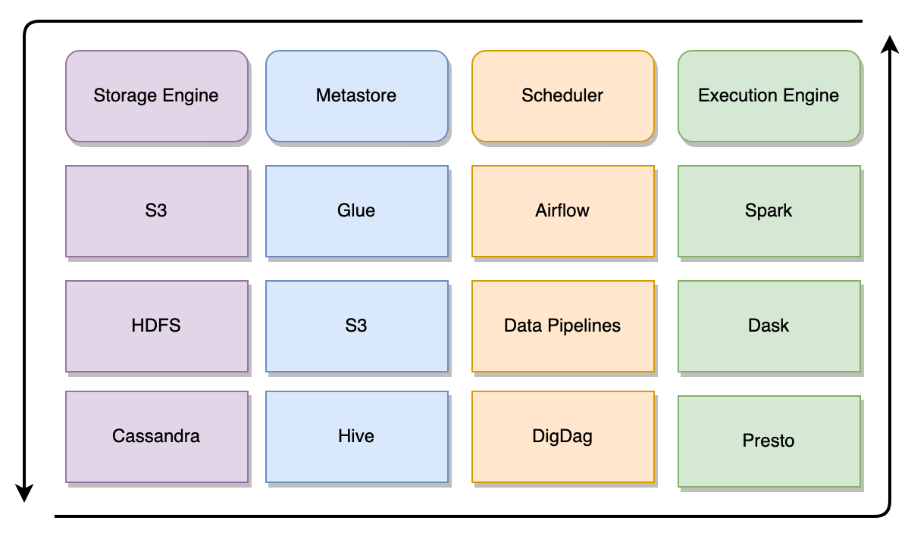

# Mason - Data Operator Framework  

What is Mason?
1.  Its a data aware analogue of airflow operators
2.  Its like react components but for data pipelines
3.  Its an open source answer to Glue
4.  It gives you self contained composable declarative functional data operators
5.  Its a crazy idea!

Mason is all of these and more s/crazy/useful/g. In short Mason is the connecting tissue for your data projects.  

Out of the box Mason defines 4 main abstractions called "Engines" which it gives you a systematic means of brokering the relationship between the engines and various clients which serve in roles as a particular engine.  

The four main engines mason ships with by default are Metastore Engines, Execution Engines, Scheduler Engines, and Storage Engines which can be described as follows:



1.   Metastore Engines - Defines concepts like databases and tables, and allows interacting with dataset metadata such as partitioning or schema information.  Some example metastore clients would be Glue, or Hive.
2.   Execution Engines - Defines a means to "compute" or derive additional datasets on source data in metastore tables.   This includes programatic serial or SQL analytical computation on data.  Example exeuction engines would be spark, presto, or athena.
3.   Scheduler Engines -  Anything that involves scheduling frequency of data jobs and job DAGS.  Example scheduler clients would be airflow, DigDag or Azkaban.
4.   Storage Engines - Any activity that involves serial (row level) access and storage of data.  Some example storage clients would be S3 or HDFS.

Mason is heavily inspired by language agnostic configuration driven tools like kubernetes, helm, and terraform.   Mason aims to help to make existing higher level open source big data tools _easier_ to coordinate with one another and make them easier to interact with for individuals of various expertise across organizations.  Mason does not attempt to make provisioning and standing up such services referenced in its configurations easier and thus is meant to be used in conjunction with tools
like kubernetes and helm.

Mason's mission is to provide ways to build composable self contained functional units called "Data Operators" which companies can stitch together to easily provide end to end data pipelines.   The target demographic of Mason are companies that are just breaking into the enterprise data space, or companies that are looking to consolidate their data operations.

## Quickstart
### Docker

If you are implementing aws clients remember to update `.env` file to include AWS credentials
```.env
AWS_ACCESS_KEY_ID=<KEY_ID>
AWS_SECRET_ACCESS_KEY=<SECRET_KEY>
```
which have the needed permissions for the AWS services you are specifying as engine clients.  You can see all such configurations for various cloud providers in `.env.example`

If you are using a kubernetes based execution engine or scheduler make sure that your kubernetes config is located at 
```
~/.kube/config
```

To build the docker image run:
```
./docker_build
```
Then run docker compose to start a mason server locally:
```
docker-compose up
```

Swagger ui for registered operators can then be found at: `http://localhost:5000/api/ui/`  

You can access additional mason commands by shelling into the running docker container and running them via docker_attach script:

```
./docker_attach
> root@<SHA>:/app# mason
Usage: mason [OPTIONS] COMMAND [ARGS]...

  ___  ___
  |  \/  |                      
  | .  . | __ _ ___  ___  _ __  
  | |\/| |/ _` / __|/ _ \| '_ \ 
  | |  | | (_| \__ \ (_) | | | |
  \_|  |_/\__,_|___/\___/|_| |_|

  Mason Data Operator Framework

Options:
  --help  Show this message and exit.

Commands:
  config    Configures mason clients and engines
  operator  Executes and lists mason operators
  register  Registers mason operator
  run       Runs mason flask server on port 5000

```

Note that the Dockerfile registers a set of example operators by default.  Comment out these lines and register different operators if you wish to do so during docker build.

### Python Package

To install the python `mason` package instead first run:
```
./scripts/install.sh
```
Mason leverages `mypy` heavily for ensuring that function signatures and types are in line. Install will run mypy and stop if it does not succeed.  

### Basic Mason Commands

To configure mason run `mason config`.  Configurations are validated for basic structure using json_schema.  See `configurations/schema.json`:

```
>> mason config examples/configs/
+---------------------------------------------+
| Creating MASON_HOME at /Users/kyle/.mason/  |
+---------------------------------------------+
+---------------------------------------------------------------------+
| Creating OPERATOR_HOME at /Users/kyle/.mason/registered_operators/  |
+---------------------------------------------------------------------+
+-------------------------------------------------------------+
| Creating CONFIG_HOME at /Users/kyle/.mason/configurations/  |
+-------------------------------------------------------------+

Valid Configuration. Saving config examples/configs/config_1.yaml to /Users/kyle/.mason/configurations/
Valid Configuration. Saving config examples/configs/config_2.yaml to /Users/kyle/.mason/configurations/

Setting current config to 0
+-----------------+
| Configurations  |
+-----------------+
Config ID    Engine     Client    Configuration
-----------  ---------  --------  -----------------------------------------------------------------------------------------------------------
*  0         metastore  glue      {'aws_region': 'us-east-1', 'aws_role_arn': 'REDACTED', 'access_key': 'REDACTED', 'secret_key': 'REDACTED'}
             scheduler  glue      {'aws_region': 'us-east-1', 'aws_role_arn': 'REDACTED', 'access_key': 'REDACTED', 'secret_key': 'REDACTED'}
             storage    s3        {'aws_region': 'us-east-1', 'access_key': 'REDACTED', 'secret_key': 'REDACTED'}
             execution  athena    {'aws_region': 'us-east-1', 'access_key': 'REDACTED', 'secret_key': 'REDACTED'}
.  1         metastore  s3        {'aws_region': 'us-east-1', 'access_key': 'REDACTED', 'secret_key': 'REDACTED'}
             execution  spark     {'runner': {'spark_version': '2.4.5', 'type': 'kubernetes-operator'}}

* = Current Configuration
```

You will begin without any operators registered by default:
```
>> mason operator
No Operators Registered.  Register operators by running "mason register"

```
  You can register some example operators.  Operators are validated for basic structure using json_schema.  See `/operators/schema.json` for the schema description.
  
```
>> mason register examples/operators/
Valid Operator Definition examples/operators/schedule/delete/operator.yaml
Valid Operator Definition examples/operators/table/delete/operator.yaml
Valid Operator Definition examples/operators/table/merge/operator.yaml
Valid Operator Definition examples/operators/table/refresh/operator.yaml
Valid Operator Definition examples/operators/table/get/operator.yaml
Valid Operator Definition examples/operators/table/list/operator.yaml
Valid Operator Definition examples/operators/table/infer/operator.yaml
Valid Operator Definition examples/operators/table/query/operator.yaml
Valid Operator Definition examples/operators/job/get/operator.yaml
Registering operators at examples/operators/ to /Users/kyle/.mason/registered_operators/operators/
```

Listing Operators:

```
>> mason operator
mason operator

+-----------------------------------------------------------------------+
| Available Operator Methods: /Users/kyle/.mason/registered_operators/  |
+-----------------------------------------------------------------------+

namespace    command    description                                                                               parameters
-----------  ---------  ----------------------------------------------------------------------------------------  ---------------------------------------------------------------------------------------------------------------
schedule     delete     Delete schedule                                                                           {'required': ['schedule_name']}
table        delete     Delete metastore tables                                                                   {'required': ['table_name', 'database_name']}
table        merge      Merge metastore tables                                                                    {'required': ['output_path', 'input_path'], 'optional': ['extract_paths', 'repartition_keys', 'parse_headers']}
table        refresh    Refresh metastore tables                                                                  {'required': ['database_name', 'table_name']}
table        get        Get metastore table contents                                                              {'required': ['database_name', 'table_name']}
table        list       Get metastore tables                                                                      {'required': ['database_name']}
table        infer      Registers a schedule for infering the table then does a one time trigger of the refresh.  {'required': ['database_name', 'storage_path', 'schedule_name']}
table        query      Query metastore tables                                                                    {'required': ['query_string', 'database_name']}
job          get        Get Execution Job Status                                                                  {'required': ['job_id']}
```

Listing Operators for a particular namespace:

```
mason operator table

+--------------------------------------------------------------------+
| Available table Methods: /Users/kyle/.mason/registered_operators/  |
+--------------------------------------------------------------------+

namespace    command    description                                                                               parameters
-----------  ---------  ----------------------------------------------------------------------------------------  ---------------------------------------------------------------------------------------------------------------
table        delete     Delete metastore tables                                                                   {'required': ['table_name', 'database_name']}
table        merge      Merge metastore tables                                                                    {'required': ['output_path', 'input_path'], 'optional': ['extract_paths', 'repartition_keys', 'parse_headers']}
table        refresh    Refresh metastore tables                                                                  {'required': ['database_name', 'table_name']}
table        get        Get metastore table contents                                                              {'required': ['database_name', 'table_name']}
table        list       Get metastore tables                                                                      {'required': ['database_name']}
table        infer      Registers a schedule for infering the table then does a one time trigger of the refresh.  {'required': ['database_name', 'storage_path', 'schedule_name']}
table        query      Query metastore tables                                                                    {'required': ['query_string', 'database_name']}
```

Running operator with parameters argument:
```
mason operator table get -p database_name:crawler-poc,table_name:catalog_poc_data
>>
+--------------------+
| Parsed Parameters  |
+--------------------+
{'database_name': 'crawler-poc', 'table_name': 'catalog_poc_data'}

+-------------------------+
| Parameters Validation:  |
+-------------------------+
Validated: ['database_name', 'table_name']

+--------------------+
| Operator Response  |
+--------------------+
{
 "Errors": [],
 "Info": [],
 "Warnings": [],
 "Data": {
  "name": "catalog_poc_data",
  "created_at": "2020-02-26T12:57:31-05:00",
  "created_by": "arn:aws:sts::062325279035:assumed-role/AWSGlueServiceRole-anduin-data-glue/AWS-Crawler",
  "database_name": "crawler-poc",
  "schema": [...]
 }
}

```
Running operator with config parameters yaml file:

```
mason operator table get -c examples/parameters/table_get.yaml
>>
+--------------------+
| Operator Response  |
+--------------------+
{
 "Errors": [],
 "Info": [],
 "Warnings": [],
 "Data": {
  "name": "catalog_poc_data",
  "created_at": "2020-02-26T12:57:31-05:00",
  "created_by": "arn:aws:sts::062325279035:assumed-role/AWSGlueServiceRole-anduin-data-glue/AWS-Crawler",
  "database_name": "crawler-poc",
  "schema": [...]
 }
}
```

Running flask web server for registered operator API endpoints:
```
mason run
```


## Philosophy

Mason's main function is to broker the relationship between 3 main objects:
1. Clients -  Technologies which can be used in various capacities as engines
2. Engines -  The 4 main types of data engines by default (storage, execution, metastore and scheduler) which comprise of the various ways by which a client can be utilized.
3. Operators - Parameterized definitions of work which interact with the various engines.

You can think of the interaction between these 3 types of entities as follows:  
```buildoutcfg
For <CLIENT> as a <ENGINE TYPE> do <OPERATOR DEFINITION(:parameters)>
```
For example:
```buildoutcfg
For <Glue> as a <Metastore> do <List Tables>
For <Glue> as a <Scheduler> do <Trigger schedule(:schedule_name = 'test-crawler')>
For <S3> as a <Metastore> do <List Partitions(:table_name = 'test-table')>
```

In other words Engines define the valid operations which can be performed via the various clients and operators implement one or more of those operations.  In reality operators actually define sentences like the above in a complete description of work for multiple engines, i.e. one operator can implement several such statements.

## Engines 

Out of the box mason creates a layer of abstraction between these 4 engine types (storage, metastore, scheduler, execution). This is based on the observation that most data pipelines are executing operations which interact with clients serving primarily in these 4 roles.

### Defining new Engines

COMING SOON

## Clients

Clients are being added they include a number of prioprietary technologies such as Athena, Glue, Redshift but are mainly focused on open source technologies such as Presto, Airflow and Spark.

### Defining new Clients

COMING SOON

## Operators 

The main concept in mason is something called a "Data Operator".  You can think of there as being are three main types of Data Operators:

1.  Ingress Operators
2.  Transform Operators
3.  Egress Operators


### Defining new Operators:
COMING SOON


### Example: Import Operator


### Example: Dedupe Operator


### Example: Summarize Operator


### Example: Export Operator


