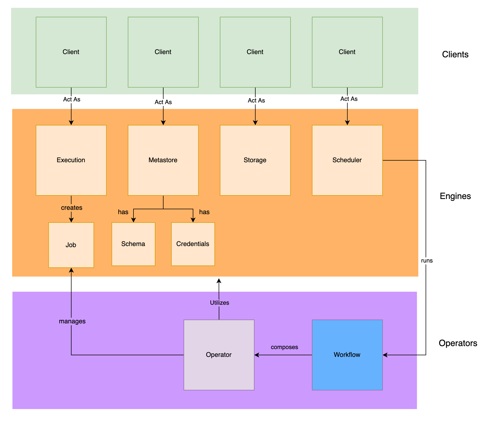

# Mason - Data Operator Framework  

What is Mason?
1.  It creates a data-aware alternative to Airflow operators that depends less heavily on Python scripting.
2.  It's like react components, but for data pipelines.
3.  It's an open source answer to Glue.
4.  It gives you self-contained, composable, parameterized, and functional data operators.

All of these statements are true to varying degrees. In short, Mason is the connecting tissue for your data projects.  

Out of the box, Mason defines 4 main abstractions called Engines. These Engines broker the relationship between Operators and Workflows, which define a particular job, and the various Clients that get the job done. 

Once configured, Mason gives you a declarative ability to perform simple statements like these:

```
mason operator table get -p "database_name:<<DATABASE_NAME>>,table_name:<<TABLE_NAME>>"
```

```
mason operator job get -p "job_id:<<JOB_ID>>"
```

```
mason operator table infer -p "storage_path:<<STORAGE_PATH>>,database_name:<<DATABASE_NAME>>,table_name:<<TABLE_NAME>>"
```

and for the operators to perform sensible actions regardless of the clients used for each engine, be they local file systems, S3, Athena, or Spark.

The four engines Mason ships with by default are Metastore, Execution, Scheduler, and Storage.


1.   Metastore - Defines concepts like databases and tables, and allows interacting with dataset metadata such as partitioning or schema information.  Some example metastore clients would be Glue and Hive.
2.   Execution - Defines a means to "compute" or derive additional datasets on source data in metastore tables.   This includes programmatic serial or SQL analytical computation on data.  Example execution engines would be Spark, Presto, and Athena.
3.   Scheduler -  Anything that involves scheduling frequency of data jobs and job DAGs.  Example scheduler clients would be Airflow, DigDag and Azkaban.
4.   Storage - Any activity that involves serial (row level) access and storage of data.  Some example storage clients would be S3 and HDFS.

Mason is heavily inspired by language-agnostic configuration-driven tools like kubernetes, helm, and terraform.   Mason aims to help to make existing higher-level open-source big-data tools easier to coordinate and interact with for individuals of varying expertise.  Mason does not attempt to make provisioning and standing up such services referenced in its configurations easier and thus is meant to be used in conjunction with tools like kubernetes and helm.

Mason's mission is to provide ways to build composable self-contained functional units called "Data Operators" which companies can stitch together to easily provide end-to-end data pipelines.   The target demographic of Mason are companies that are just breaking into the enterprise data space, or companies that are looking to consolidate their data operations.

## Quickstart

### Docker

If you are implementing AWS clients, remember to update `~/.mason/.env` to include AWS credentials. 
```.env
AWS_ACCESS_KEY_ID=<KEY_ID>
AWS_SECRET_ACCESS_KEY=<SECRET_KEY>
```
These credentials should have the needed permissions for the AWS services you are specifying as engine clients.  You can see all such configurations for various cloud providers in `.env.example`.

If you are using a kubernetes-based execution engine or scheduler, make sure that your kubernetes config is located at `~/.kube/config`.

To build the Docker image, run:
```
./docker_build
```
Then run `docker-compose` to start a mason server locally:
```
docker-compose up
```

Swagger UI for registered operators can then be found at `http://localhost:5000/api/ui/`. 

You can access additional mason commands by shelling into the running Docker container and running them via `docker_attach`:

```
./docker_attach
root@<SHA>:/app# mason
Usage: mason [OPTIONS] COMMAND [ARGS]...

  ___  ___
  |  \/  |
  | .  . | __ _ ___  ___  _ __
  | |\/| |/ _` / __|/ _ \| '_ \     
  | |  | | (_| \__ \ (_) | | | |
  \_|  |_/\__,_|___/\___/|_| |_|

  Mason Data Operator Framework

Options:
  --help  Show this message and exit.

Commands:
  config    Configures mason clients and engines
  operator  Executes and lists mason operators
  register  Registers mason operators or workflows
  run       Runs mason flask server on port 5000
  workflow  Executes and lists mason workflows 
```

Note that the Dockerfile registers a set of example operators by default.  Comment out these lines and register different operators if you wish to do so during Docker build.

### Python Package

To install the python `mason` package instead, first run:
```
./scripts/install.sh
```
Mason leverages `mypy` heavily to ensure that function signatures and types are in line. To run the tests for mason (which includes running mypy by default), run:

```
./scripts/test.sh
```

### Basic Mason Commands

To configure Mason, run `mason config`.  Configurations are validated for basic structure using json_schema.  See `configurations/schema.json`:

```
>> mason config mason/examples/configs/
+-------------------------------------+
| Creating MASON_HOME at   ~/.mason/  |
+-------------------------------------+
+------------------------------------------------------------+
| Creating OPERATOR_HOME at  ~/.mason/registered_operators/  |
+------------------------------------------------------------+
+------------------------------------------------------------+
| Creating WORKFLOW_HOME at  ~/.mason/registered_workflows/  |
+------------------------------------------------------------+
+----------------------------------------------------+
| Creating CONFIG_HOME at  ~/.mason/configurations/  |
+----------------------------------------------------+
2020-06-22 13:34:32.363062: Setting current config to 1
+-----------------+
| Configurations  |
+-----------------+
Config ID    Engine     Client    Configuration
-----------  ---------  --------  -----------------------------------------------------------------------------------------------------------
*  1         metastore  glue      {'aws_region': 'us-east-1', 'aws_role_arn': 'REDACTED', 'access_key': 'REDACTED', 'secret_key': 'REDACTED'}
             scheduler  glue      {'aws_region': 'us-east-1', 'aws_role_arn': 'REDACTED', 'access_key': 'REDACTED', 'secret_key': 'REDACTED'}
             storage    s3        {'aws_region': 'us-east-1', 'access_key': 'REDACTED', 'secret_key': 'REDACTED'}
             execution  athena    {'aws_region': 'us-east-1', 'access_key': 'REDACTED', 'secret_key': 'REDACTED'}
.  2         metastore  s3        {'aws_region': 'us-east-1', 'access_key': 'REDACTED', 'secret_key': 'REDACTED'}
             execution  spark     {'runner': {'spark_version': '2.4.5', 'type': 'kubernetes-operator'}}
.  3         metastore  athena    {'aws_region': 'us-east-1', 'access_key': 'REDACTED', 'secret_key': 'REDACTED'}
             scheduler  local     {}
             storage    s3        {'aws_region': 'us-east-1', 'access_key': 'REDACTED', 'secret_key': 'REDACTED'}

* = Current Configuration
2020-06-22 13:34:32.365738: Valid Configuration. Saving config 1 at mason/examples/configs/config_1.yaml to ~/.mason/configurations/
2020-06-22 13:34:32.365975: Valid Configuration. Saving config 2 at mason/examples/configs/config_2.yaml to ~/.mason/configurations/
2020-06-22 13:34:32.366186: Valid Configuration. Saving config 3 at mason/examples/configs/config_3.yaml to ~/.mason/configurations/
```

#### Setting Current Configuration

```
>> mason config -s 3
2020-06-22 13:37:14.572590: Setting current config to 3
+-----------------+
| Configurations  |
+-----------------+
Config ID    Engine     Client    Configuration
-----------  ---------  --------  -----------------------------------------------------------------------------------------------------------
.  1         metastore  glue      {'aws_region': 'us-east-1', 'aws_role_arn': 'REDACTED', 'access_key': 'REDACTED', 'secret_key': 'REDACTED'}
             scheduler  glue      {'aws_region': 'us-east-1', 'aws_role_arn': 'REDACTED', 'access_key': 'REDACTED', 'secret_key': 'REDACTED'}
             storage    s3        {'aws_region': 'us-east-1', 'access_key': 'REDACTED', 'secret_key': 'REDACTED'}
             execution  athena    {'aws_region': 'us-east-1', 'access_key': 'REDACTED', 'secret_key': 'REDACTED'}
.  2         metastore  s3        {'aws_region': 'us-east-1', 'access_key': 'REDACTED', 'secret_key': 'REDACTED'}
             execution  spark     {'runner': {'spark_version': '2.4.5', 'type': 'kubernetes-operator'}}
*  3         metastore  athena    {'aws_region': 'us-east-1', 'access_key': 'REDACTED', 'secret_key': 'REDACTED'}
             scheduler  local     {}
             storage    s3        {'aws_region': 'us-east-1', 'access_key': 'REDACTED', 'secret_key': 'REDACTED'}

* = Current Configuration
```

You will begin without any operators registered by default:
```
>> mason operator
No Operators Registered.  Register operators by running "mason register"
```
You can register some example operators.  Operators are validated for basic structure using json_schema.  See `/operators/schema.json` for the schema description.
  
```
>> mason register mason/examples/operators/
Valid operator definition.  Registering mason/examples/operators/schedule/delete to  ~/.mason/registered_operators/schedule/delete/
Valid operator definition.  Registering mason/examples/operators/table/delete to  ~/.mason/registered_operators/table/delete/
Valid operator definition.  Registering mason/examples/operators/table/merge to  ~/.mason/registered_operators/table/merge/
Valid operator definition.  Registering mason/examples/operators/table/refresh to  ~/.mason/registered_operators/table/refresh/
Valid operator definition.  Registering mason/examples/operators/table/get to  ~/.mason/registered_operators/table/get/
Valid operator definition.  Registering mason/examples/operators/table/list to  ~/.mason/registered_operators/table/list/
Valid operator definition.  Registering mason/examples/operators/table/infer to  ~/.mason/registered_operators/table/infer/
Valid operator definition.  Registering mason/examples/operators/table/query to  ~/.mason/registered_operators/table/query/
Valid operator definition.  Registering mason/examples/operators/job/get to  ~/.mason/registered_operators/job/get/
```

#### Listing Operators

```
>> mason operator
+-------------------------------------------------------------+
| Available Operator Methods: ~/.mason/registered_operators/  |
+-------------------------------------------------------------+

namespace    command    description                         parameters
-----------  ---------  ----------------------------------  ---------------------------------------------------------------------------------------------------------------
schedule     delete     Delete schedule                     {'required': ['schedule_name'], 'optional': []}
table        delete     Delete metastore tables             {'required': ['table_name', 'database_name'], 'optional': []}
table        merge      Merge metastore tables              {'required': ['output_path', 'input_path'], 'optional': ['extract_paths', 'repartition_keys', 'parse_headers']}
table        refresh    Refresh metastore tables            {'required': ['database_name', 'table_name'], 'optional': []}
table        get        Get metastore table contents        {'required': ['database_name', 'table_name'], 'optional': []}
table        list       Get metastore tables                {'required': ['database_name'], 'optional': []}
table        infer      Infers schema for metastore tables  {'required': ['database_name', 'storage_path'], 'optional': ['table_name']}
table        query      Query metastore tables              {'required': ['query_string', 'database_name'], 'optional': []}
job          get        Get Execution Job Status            {'required': ['job_id'], 'optional': []}
```

#### Listing Operators for a Particular Namespace

```
>> mason operator job
+------------------------------------------------------------------+
| Available job Methods: ~/.mason/registered_operators/  |
+------------------------------------------------------------------+

namespace    command    description               parameters
-----------  ---------  ------------------------  ----------------------------------------
job          get        Get Execution Job Status  {'required': ['job_id'], 'optional': []}
```

#### Running Operator with Parameters Argument

```
>> mason operator table get -p database_name:spg-mason-demo,table_name:merged_csv
Fetching keys at spg-mason-demo/merged_csv
+--------------------+
| Operator Response  |
+--------------------+
{
 "Errors": [],
 "Info": [],
 "Warnings": [],
 "Data": [
  {
   "Name": "merged_csv",
   "CreatedAt": "",
   "CreatedBy": "mason",
   "Schema": {
    "SchemaType": "parquet",
    "Columns": [
     {
      "Name": "crane",
      "Type": "BYTE_ARRAY",
      "ConvertedType": "UTF8",
      "RepititionType": "OPTIONAL"
     },
     {
      "Name": "5000.0",
      "Type": "BYTE_ARRAY",
      "ConvertedType": "UTF8",
      "RepititionType": "OPTIONAL"
     },
     {
      "Name": "Case",
      "Type": "BYTE_ARRAY",
      "ConvertedType": "UTF8",
      "RepititionType": "OPTIONAL"
     },
     {
      "Name": "false",
      "Type": "BYTE_ARRAY",
      "ConvertedType": "UTF8",
      "RepititionType": "OPTIONAL"
     }
    ]
   }
  }
 ]
}

```

#### Running Operator with Config Parameters YAML File

```
>> mason operator table get -f examples/parameters/table_get.yaml 
+--------------------+
| Operator Response  |
+--------------------+
{
 "Errors": [],
 "Info": [],
 "Warnings": [],
 "Data": [
  {
   "Name": "catalog_poc_data",
   "CreatedAt": "2020-02-26T12:57:31-05:00",
   "CreatedBy": "crawler:test_crawler",
   "Schema": {
    "SchemaType": "glue",
    "Columns": [...]
   }
  }
 ]
}
```


#### Running Flask Web Server for Registered Operator API Endpoints (port 5000)
```
mason run
```

## Advanced Usage



Mason's main function is to broker the relationship between 3 main objects:
1. Clients -  Technologies which can be used in various capacities as engines
2. Engines -  The 4 main types of data engines by default (storage, execution, metastore and scheduler) which comprise the various ways in which a client can be utilized.  This creates an abstraction for the main types of objects (Tables, Jobs, Schemas, etc.) that you would interact with while building data pipelines.
3. Operators - Parameterized definitions of work which interact with the various engines.

You can think of the interaction between these 3 types of entities as follows:  
```buildoutcfg
For <CLIENT> as a <ENGINE TYPE> do <OPERATOR DEFINITION(:parameters)>
```
For example:
```buildoutcfg
For <Glue> as a <Metastore> do <List Tables>
For <Glue> as a <Scheduler> do <Trigger schedule(:schedule_name = 'test-crawler')>
For <S3> as a <Metastore> do <List Partitions(:table_name = 'test-table')>
```

## Engines 

Mason creates Engines as a layer of abstraction above clients, defining four roles under which clients act: Storage, Metastore, Scheduler, and Execution. This is based on the observation that most data pipelines execute operations which interact with clients serving primarily in these 4 roles.

### Engine Models:
Each engine has a set of associated "canonical models" (located in engines/<ENGINE_TYPE>/models) which are used in the creation of operators.  These canonical models frequently correspond to operator namespaces but don't necessarily have to.  Some example canonical models currently defined in the operator examples are:

```
Schema
Job
Credentials
Dag
Table
```

### Defining new Engines

`COMING SOON`

## Operators 

Here are some example operators that are included with mason:


```table merge```


```table query```


For more operators see `examples/operators`.  Upcoming planned operators include:

```table dedupe```


```table summarize```


In other words, Engines define the valid operations which can be performed via the various clients, and Operators implement one or more of those operations. Operators define sentences like the above using as many operations from as many Engines as necessary; they aren't restricted to using only one statement.

### Creating new operators
Look in `examples/operators/` for example operator definitions.  The general anatomy of an operator (currently) consists of three parts:

1.  An `operator.yaml` definition file. This defines the operator namespace, command name, and any required configurations.  
2.  An `__init__.py` which defines the work to be done by the operator.  
3.  An optional `swagger.yaml` file. This exposes the operator in the Mason API, and is rolled up into Mason's main Swagger definition before running the API server. Operators without this file are still accessible via `mason operator cli command`.
    * If `swagger.yaml` is included, also add the following to `__init__.py`:

    ```
    def api(*args, **kwargs): return OperatorApi.get("<NAMESPACE>", "COMMAND", *args, **kwargs)
    ```

By convention, an `operator.yaml` file and its `__init__.py` are colocated in a directory for the <COMMAND> name under the namespace directory:
```
<NAMESPACE>
|
-------<COMMAND 1>
    |       |
    |       ----- operator.yaml
    |       |
    |       ----- __init__.py
    |       |
    |       ----- swagger.yml
    |
    ---<COMMAND 2>
            |
            ----- operator.yaml
            |
            ----- __init__.py
            |
            ----- swagger.yml
```

However, this is not strictly required.  All that is required is for the necessary files for a single operator definition to be colocated in a folder containing the operator.yaml.

### Operator Defintions

Here is an example `__init__.py` for the operator `table:get`:

```
from mason.clients.response import Response
from mason.configurations.valid_config import ValidConfig
from mason.api import operator_api as OperatorApi
from mason.operators.operator_definition import OperatorDefinition
from mason.operators.operator_response import OperatorResponse
from mason.parameters.validated_parameters import ValidatedParameters
from mason.util.environment import MasonEnvironment

def api(*args, **kwargs): return OperatorApi.get("table", "get", *args, **kwargs)

class TableGet(OperatorDefinition):
    def run(self, env: MasonEnvironment, config: ValidConfig, parameters: ValidatedParameters, resp: Response) -> OperatorResponse:
        database_name: str = parameters.get_required("database_name")
        table_name: str = parameters.get_required("table_name")

        table, response = config.metastore.client.get_table(database_name, table_name, response=resp)
        return OperatorResponse(response, table)
```


Notice that it inherits from `OperatorDefintion`, mypy to enforce the operator to be defined consistently.  The class inhereting the definition must also be the camel cased version of the operator namespace and command (`table:get -> TableGet`).  This provides the abstract class from which all operators should be defined, namely, it enforces that operators should have a `run` method which defines the instructions for how the operator should execute on canonical engine model objects.


#### Note on operator.yaml
Supported configurations for an operator are sets of supported engines.  For example an operator with the following operator.yaml:
```
type: "operator"
namespace: "schedule"
command: "delete"
description:  "Delete schedule"
parameters:
  required:
    - schedule_name
supported_configurations:
  - scheduler: "glue"
```

would accept a configuration as follows:
```
metastore_engine: glue
storage_engine: s3
scheduler_engine: glue
execution_engine: athena
clients:
 ...
```
Because the scheduler is defined to be glue, the other engines in this case do not matter, and it would only reject configurations with a different scheduler engine. However, an operator with supported_configurations like this:
```
type: "operator"
namespace: "table"
command: "merge"
description:  "Merge metastore tables"
parameters:
  required:
    - output_path
    - input_path
  optional:
    - extract_paths
    - repartition_keys
    - parse_headers
supported_configurations:
  - metastore: "s3"
    execution: "spark"
```

would only accept an operator configured with both `metastore: s3` and `execution: spark`.  

## Workflows 

Workflows are a new feature that allows you to compose operators in a DAG (Directed Acyclic Graph) definition, validate the Dag in conjunction with specific configurations and parameters, then pass it to a scheduler engine to execute.  Note that Mason does not try to focus on providing a scheduler itself, but instead interfaces with known scheduler engines such as Glue, Airflow, or DigDag, and gives them specificed instructions on how to operate.  Mason does come with a `LocalSchedulerClient` or `local` scheduler which allows you to run a workflow synchronously locally.  `AsyncClient` is planned but preference will be to use more robust async schedulers like Airflow.

### Registering Workflows

```
>> mason register mason/examples/workflows/
Valid workflow definition.  Registering mason/examples/workflows/table/validated_infer to /Users/kyle/.mason/registered_workflows/table/validated_infer/
Valid workflow definition.  Registering mason/examples/workflows/table/infer to /Users/kyle/.mason/registered_workflows/table/infer/
```

### Listing Workflows

```
>>mason workflow

+-------------------------------------------------------------+
| Available Workflow Methods: ~/.mason/registered_workflows/  |
+-------------------------------------------------------------+

namespace    command          description
-----------  ---------------  ---------------------------------------------------------------------------------------------
table        validated_infer  5 step workflow for inferring table and checking if it worked, then cleaning up if it didn't.
table        infer            One step workfow for table infer operator


```

Doing a Dry Run for a Workflow (dry-run is set to True by default):

Note that workflows, unlike operators, must be run using `parameter.yaml` files. There is no shorthand syntax for workflow parameters (`-p` flag).  You must use the `-f` flag and provide a parameter yaml file:

```
>> mason workflow table validated_infer -f mason/examples/parameters/validated_infer.yaml 
2020-06-22 14:16:36.086475: Performing Dry Run for Workflow.  To Deploy workflow use --deploy -d flag.  To run now use the --run -r flag
2020-06-22 14:16:36.086524
2020-06-22 14:16:36.086534: Valid Workflow DAG Definition:
2020-06-22 14:16:36.086541: --------------------------------------------------------------------------------
2020-06-22 14:16:36.088688: * step_1
* step_2
* step_3
* step_4
* step_5

2020-06-22 14:16:36.088717
+--------------------+
| Workflow Response  |
+--------------------+
{
 "Errors": [],
 "Info": [
  "2020-06-22 14:16:36.086475: Performing Dry Run for Workflow.  To Deploy workflow use --deploy -d flag.  To run now use the --run -r flag",
  "2020-06-22 14:16:36.086524",
  "2020-06-22 14:16:36.086534: Valid Workflow DAG Definition:",
  "2020-06-22 14:16:36.086541: --------------------------------------------------------------------------------",
  "2020-06-22 14:16:36.088688: * step_1\n* step_2\n* step_3\n* step_4\n* step_5\n",
  "2020-06-22 14:16:36.088717"
 ],
 "Warnings": []
}
```

### Deploying a Workflow (with `-d` flag)

```
>> mason workflow table infer -f mason/examples/parameters/workflow_table_infer.yaml -d
Registering workflow dag table_infer with glue.
Created table crawler table_infer.
Registered schedule table_infer
+--------------------+
| Workflow Response  |
+--------------------+
{
 "Errors": [],
 "Info": [
  "Registering workflow dag table_infer with glue.",
  "Created table crawler table_infer.",
  "Registered schedule table_infer"
 ],
 "Warnings": []
}
```

### Running a Workflow Synchronously (with `-r` flag)

```
Registering workflow dag table_infer with glue.
Created table crawler table_infer.
Registered schedule table_infer
Triggering schedule: table_infer
Refreshing Table Crawler: table_infer
+--------------------+
| Workflow Response  |
+--------------------+
{
 "Errors": [],
 "Info": [
  "Registering workflow dag table_infer with glue.",
  "Created table crawler table_infer.",
  "Registered schedule table_infer",
  "Triggering schedule: table_infer",
  "Refreshing Table Crawler: table_infer"
 ],
 "Warnings": []
}
```

### Creating Workflows

Workflows are defined in a similar manner to operators.  Workflows because they are composed of operators do not require a run method but rather may require a "step" method which defines how the workflow is allowed to progress from one step to another.  Here is an example workflow definition:

```
from typing import Union

from mason.engines.metastore.models.table import Table

from mason.engines.scheduler.models.dags.failed_dag_step import FailedDagStep
from mason.engines.scheduler.models.dags.executed_dag_step import ExecutedDagStep
from mason.engines.scheduler.models.dags.valid_dag_step import ValidDagStep
from mason.workflows.workflow_definition import WorkflowDefinition

class Namespace1Workflow5(WorkflowDefinition):
    def step(self, current: ExecutedDagStep, next: ValidDagStep) -> Union[ValidDagStep, FailedDagStep]:
        if current.step.id == "step_1":
            if isinstance(current.operator_response.object, Table):
                return next
            else:
                return current.failed("Table not found in operator_response")
        else:
            return next

```

Notice that it inherits from `WorkflowDefinition`. This allows mypy to enforce the operator to be defined consistently.  The class inheriting the definition must also be the camel-cased version of the operator namespace and command (`namespace1:workflow1 -> Namespace1Workflow1`).  This provides the abstract class from which all workflows should be defined; namely, it enforces that workflows should have a `step` method which defines the instructions for how the workflow should progress from one step to the next in the DAG along its edges.

Workflows require a `workflow.yaml` file with specified values of `dag` for the dag instructions of the workflow and `supported_schedulers` for the scheduler of the workflow.  Here is an example `workflow.yaml` file:

```
type: "workflow"
namespace: "table"
command: "infer"
name: "table_infer"
description: "One step workfow for table infer operator"
dag:
    - id: "step_1"
      type: "operator"
      namespace: "table"
      command: "infer"
supported_schedulers:
  - "glue"
```

Notice that the `dag` attribute is an array with steps that each have an "id".  This "id" is what is referenced by the parameters file when running the workflow.   Here is an example `parameters.yaml` file for running a workflow:

```
step_1:
  config_id: 1
  parameters:
    database_name: "test-database"
    storage_path: "spg-mason-demo/part_data_merged/"
```

The first value in the parameters.yaml file references the step_1 step id.   Notice that the parameters are the same parameters that would be required for running the table infer operator by itself (`database_name` and `storage_path`).  This is validated when the workflow is deployed or run and is inferred from the associated namespace and command in the original workflow dag definition.

Right now workflows only support composing `operator` types, but functionality to compose other workflows is planned.

## Clients

Clients include a number of prioprietary technologies such as Athena, Glue, and Redshift, but are mainly focused on open-source technologies such as Presto, Airflow and Spark.  For example, Glue is currently supported; however, as Mason begins to interface directly with Athena and Presto, Glue will become de-emphasized.

### Defining new Clients

Clients have 3 necessary parts:

1. A schema.json located in `mason/clients/<CLIENT_NAME>/`  
2. A class which contains a Client definition. This defines the interface a client exposes to Mason.
3. For each Engine a client implements, an Engine definition file.  For example, if you intend to use Glue as both a Metastore (accessing Glue Data Catalog) as well as a Scheduler (creating Glue crawlers), then you would create both `metastore.py` and `scheduler.py`.

Every Engine has a set of "canonical" functions: the actions that can be taken by said engine.  See `clients/engines/`.  If you extend an engine to include a new action type, you will need to add accompanying abstract methods to these classes, which will be enforced by mypy.   If a particular client will not currently support a function included in an Engine it implements, an accompying empty action that raises NotImplemented must be added.  Mason is built around an "allowlist" approach to support for clients and engines, so this is encouraged.  However, new functions - especially ones that have very bespoke applications to one client - should be added infrequently.  If a particular action is extremely bespoke and cannot be expressed in terms of existing canonical verbs for an engine type, then it is recommended that a new engine type be created.

For more information, see existing client implementations in `mason/clients/`.

